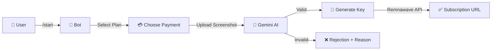

<p align="center">
  
  
  
  
</p>

<h1 align="center">🌊 Wavy VPN Bot</h1>

<p align="center">
  <strong>Automated Telegram VPN Sales with AI-Powered Fraud Detection</strong>
</p>

<p align="center">
  A production-ready Telegram bot that automates VPN subscription sales with instant AI verification of payment screenshots and automatic key generation via Remnawave.
</p>

---

## ✨ Features

| Feature | Description |
|---------|-------------|
| 🤖 **Telegram Bot** | Smooth conversational experience built with Grammy |
| 🧠 **AI Fraud Detection** | Google Gemini 2.0 Flash analyzes payment screenshots in <3 seconds |
| 🔑 **Instant Key Generation** | Automatic subscription URL generation via Remnawave API |
| 🌐 **Multi-Language** | Full English and Myanmar (Burmese) support |
| 🎟️ **Promo Codes** | Plan-specific discounts with usage limits and expiration |
| 💳 **Multiple Payment Methods** | KBZPay, Wave Money, and Aya Pay integration |
| 📊 **Admin Dashboard** | Transaction stats, recent activity, and promo management |
| 🛡️ **Anti-Spam Protection** | Rate limiting to prevent abuse |
| ⚡ **High Performance** | In-memory caching, retry logic with exponential backoff |

---

## 📦 Subscription Plans

| Plan | Duration | Data | Price (MMK) |
|------|----------|------|-------------|
| 1 Month Lite | 30 Days | 100 GB | 5,000 |
| 1 Month Unlimited | 30 Days | ♾️ Unlimited | 10,000 |
| 3 Months Lite | 90 Days | 300 GB | 13,500 |
| 3 Months Unlimited | 90 Days | ♾️ Unlimited | 27,000 |
| 6 Months Lite | 180 Days | 600 GB | 25,000 |
| 6 Months Unlimited | 180 Days | ♾️ Unlimited | 50,000 |

---

## 📱 User Guide | အသုံးပြုနည်း လမ်းညွှန်

<details>
<summary><strong>🤖 For Android</strong></summary>

### English

1. **Install the App**: Download [Happ Proxy](https://play.google.com/store/apps/details?id=com.happproxy&hl=en) from Play Store or use the provided link.

2. **Add Subscription**: Click the "Add Subscription" button on the link page. Servers will be automatically imported into the app.

3. **Alternative Method**: If the button doesn't work, copy the subscription URL and tap "Import from Clipboard" inside the Happ App.

4. **Connect**: Select your preferred server and tap Connect. You're ready to browse securely!

---

### မြန်မာ

1. **App ထည့်သွင်းခြင်း**: ပေးထားသော Link သို့မဟုတ် Play Store မှ [Happ Proxy](https://play.google.com/store/apps/details?id=com.happproxy&hl=en) App ကို Install လုပ်ပါ။

2. **Subscription ထည့်ခြင်း**: Link စာမျက်နှာရှိ "Add Subscription" ခလုတ်ကို နှိပ်ပါ။ App ထဲသို့ Server များ အလိုအလျောက် ရောက်သွားပါမည်။

3. **အခြားနည်းလမ်း**: နှိပ်လို့မရပါက Link ကို Copy ယူပြီး Happ App ထဲရှိ "Import from Clipboard" ကို နှိပ်ပါ။

4. **ချိတ်ဆက်ခြင်း**: ကြိုက်နှစ်သက်ရာ Server တစ်ခုရွေးပြီး Connect လုပ်ကာ စတင်အသုံးပြုနိုင်ပါပြီ။

</details>

<details>
<summary><strong>🍎 For iOS (iPhone/iPad)</strong></summary>

### English

1. **Install the App**: Search for "Happ Proxy" in the [App Store](https://apps.apple.com/sg/app/happ-proxy-utility/id6504287215) and download it.

2. **Open Subscription Link**: Click the subscription URL provided by the bot.

3. **Copy the Link**: Tap the chain icon (🔗) next to the Telegram logo, then tap "Copy Link" below the QR code.

4. **Import to App**: Open Happ Proxy app and tap "Import from Clipboard".

5. **Connect**: Tap Connect and enjoy secure browsing!

---

### မြန်မာ

1. **App ထည့်သွင်းခြင်း**: [App Store](https://apps.apple.com/sg/app/happ-proxy-utility/id6504287215) တွင် "Happ Proxy" ကို ရှာပြီး download ဆွဲပါ။

2. **Link ဖွင့်ခြင်း**: Bot မှ ပေးထားသော subscription link ကို click နှိပ်ပါ။

3. **Link ကူးခြင်း**: Telegram logo ဘေးက chain ပုံလေး (🔗) ကိုနှိပ်ပြီး QR code အောက်က "Copy Link" ဖြင့် link ကူးပါ။

4. **App သို့ ထည့်သွင်းခြင်း**: Happ Proxy app ကိုဝင်ပြီး "Import from Clipboard" နှိပ်ပါ။

5. **ချိတ်ဆက်ခြင်း**: Connect နှိပ်ပြီးသုံးလို့ရပါပြီ။

</details>

> 💬 **အဆင်မပြေရင် ပြောပါဗျ။ Video guide ပို့ပေးပါမယ်။**
>
> If you need help, contact support for a video guide.

---

## 🚀 Quick Start

### Prerequisites

- Docker & Docker Compose installed
- Telegram Bot Token from [@BotFather](https://t.me/BotFather)
- [Google Gemini API Key](https://aistudio.google.com/apikey)
- Remnawave Panel with API access

### Installation

```bash
# Clone the repository
git clone https://github.com/Ospeto/wavy.git
cd wavy

# Create environment file
cp .env.example .env

# Edit with your credentials
nano .env

# Start the bot
docker-compose up -d --build
```

### Environment Variables

Create a `.env` file in the root directory:

```env
# Telegram
TELEGRAM_BOT_TOKEN=your_bot_token_here

# Remnawave Panel
REMNAWAVE_API_URL=https://your-panel.example.com
REMNAWAVE_API_KEY=your_remnawave_api_key

# Google Gemini AI
GEMINI_API_KEY=your_gemini_api_key

# Admin Access (comma-separated Telegram User IDs)
ADMIN_USER_IDS=123456789,987654321
```

---

## 🎯 How It Works



1. **User starts** the bot and selects a subscription plan
2. **Chooses payment method** (KBZPay, Wave, Aya)
3. **Uploads payment screenshot** after making the transfer
4. **Gemini AI verifies** the screenshot in <3 seconds
5. **Key is generated** automatically via Remnawave if valid

---

## 🛡️ Fraud Detection

The AI verification system performs comprehensive checks:

| Check | Description |
|-------|-------------|
| 📱 **App Matching** | Rejects if screenshot app doesn't match selected payment method |
| 👤 **Recipient Validation** | Verifies payment was sent to "Moe Kyaw Aung" ending in 2220 |
| 💰 **Amount Verification** | Confirms exact expected amount was paid |
| 🔒 **Status Check** | Must show "Success" or "ငွေလွှဲပြီးပါပြီ" |
| 🆔 **Transaction ID** | Extracts and validates unique transaction ID |
| 🔄 **Duplicate Prevention** | Checks if transaction ID was already used |
| 🖼️ **Image Integrity** | Detects digital manipulation, font mismatches, pixelation |
| ⚠️ **Keyword Blocking** | Rejects if "VPN" appears in payment notes |

---

## 👨‍💼 Admin Commands

| Command | Description |
|---------|-------------|
| `/admin` | System stats and transaction summary |
| `/admin_tx` | View last 10 transactions with details |
| `/addpromo <code> <discount%> <limit> <days> [plan_id]` | Create a promo code |
| `/admin_plans` | List all plan IDs for promo code targeting |

### Creating Promo Codes

```bash
# 20% off on all plans, 50 uses, valid for 7 days
/addpromo SAVE20 20 50 7

# 100% off (free) for 1-month unlimited only, 10 uses, 3 days
/addpromo FREEMONTH 100 10 3 1m-unlimited
```

---

## 📱 User Commands

| Command | Description |
|---------|-------------|
| `/start` | Begin subscription process |
| `/plans` | View available plans |
| `/help` | Instructions and FAQ |
| `/language` | Switch between English and Myanmar |

---

## 🏗️ Project Structure

```
wavy/
├── backend/
│   └── src/
│       ├── bot/
│       │   ├── handlers/      # Command and callback handlers
│       │   ├── constants.ts   # Plans and payment methods
│       │   ├── translations.ts # EN/MM translations
│       │   ├── types.ts       # Shared TypeScript types
│       │   └── index.ts       # Bot entry point
│       ├── config.ts          # Environment configuration
│       ├── database.ts        # JSON database with caching
│       ├── gemini.ts          # AI verification logic
│       ├── httpClient.ts      # HTTP client with error handling
│       └── remnawave.ts       # Remnawave API integration
├── docker-compose.yml
├── Dockerfile
└── .env
```

---

## 🔧 Maintenance

### Docker Commands

```bash
# View real-time logs
docker-compose logs -f

# Restart the bot
docker-compose restart

# Rebuild after code changes
docker-compose up -d --build

# Stop the bot
docker-compose down
```

### Database

Transaction data is persisted in a Docker volume (`wavy-data`). To backup:

```bash
docker cp wavy-bot:/app/data/transactions.json ./backup.json
```

---

## 📊 Resource Requirements

| Resource | Minimum | Recommended |
|----------|---------|-------------|
| **CPU** | 0.5 Core | 1 Core |
| **RAM** | 512 MB | 1 GB |
| **Storage** | 2 GB | 5 GB |
| **OS** | Linux (Ubuntu/Debian) | Docker-compatible |

---

## 🔐 Security Features

- ✅ Input validation for all admin commands
- ✅ Rate limiting for screenshot uploads
- ✅ Transaction ID uniqueness enforcement
- ✅ Secure API key management via environment variables
- ✅ Admin-only command access control
- ✅ Retry logic with exponential backoff for external APIs

---

## 📄 License

This project is licensed under the MIT License.

---

<p align="center">
  Made with 🌊 by <a href="https://github.com/Ospeto">Ospeto</a>
</p>
